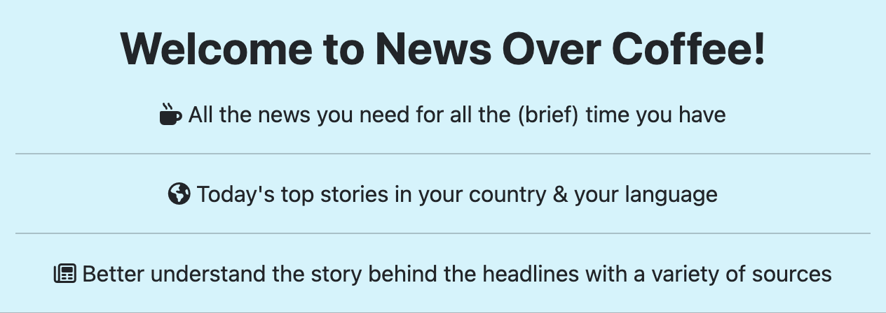
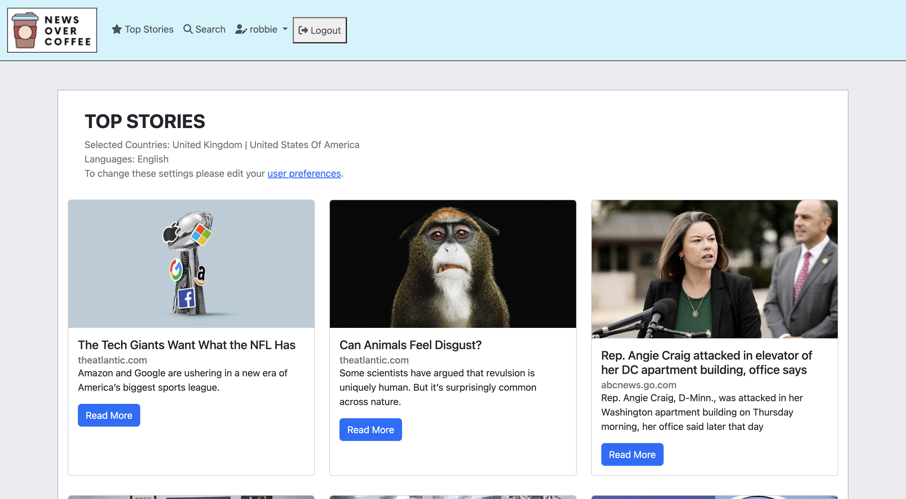
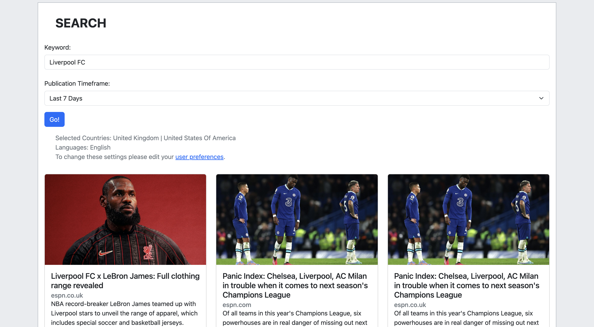
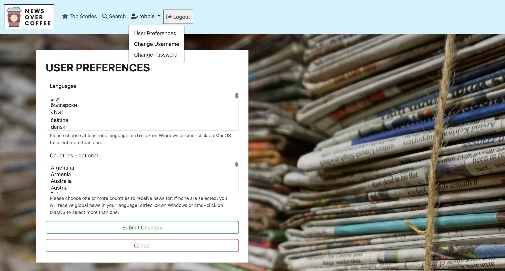
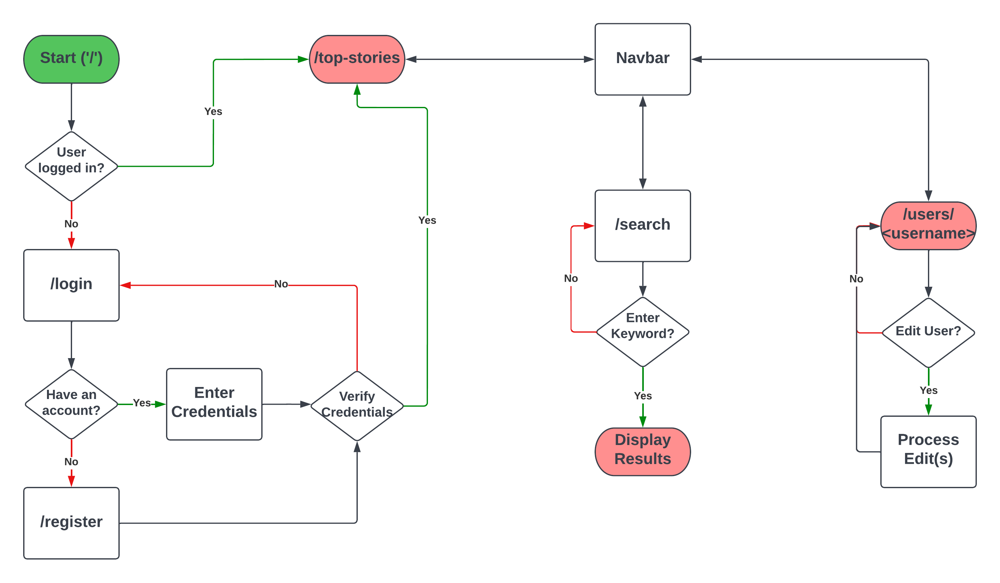
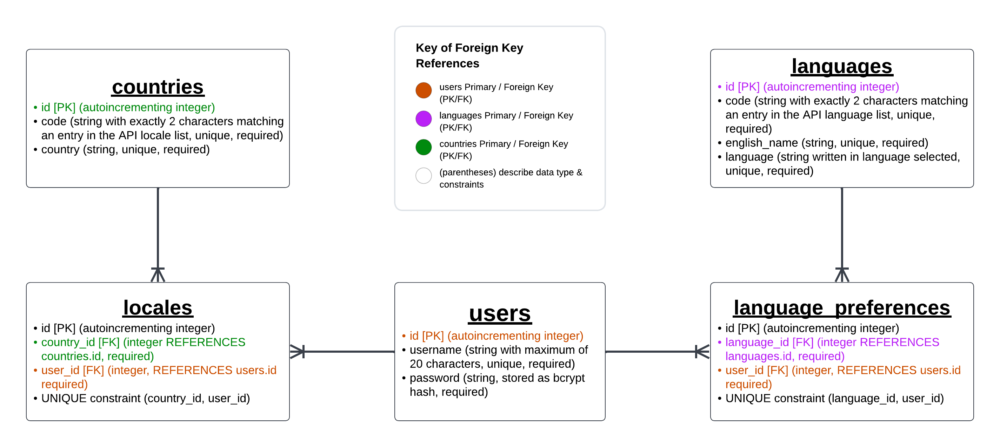

# News Over Coffee

## Springboard Capstone One

### James "Robbie" Gathje

Check out the site! [News Over Coffee](https://news-over-coffee.herokuapp.com/)

## Overview

News Over Coffee seeks to present up-to-the-minute news for every user in their chosen countries & languages. In order to do that, we collect top stories by those user preferences from [The News API](https://www.thenewsapi.com/). Collecting top stories from varied sources empowers users to look past the headlines and understand the stories themselves. And collecting in many languages from many countries allows users to step out of their more localized news cycle.

Further, News Over Coffee allows users to search for news by keyword or phrase in order to truly dig into a particular story or topic.

Lastly, users are able to edit their preferences at any time through the User Preferences link in the dropdown box behind their username in the navbar.

User Flow:

## Testing

Tests are all found in the tests/ directory and can be run from the command line in the root directory with:

`python3 -m unittest tests/{NAME\_OF\_FILE}`

## Technologies Used

* [The News API](https://www.thenewsapi.com/)
* Python
* Flask
* PostgreSQL
* SQLAlchemy
* JavaScript
* bcrypt
* HTML
* Bootstrap
* CSS

Database Schema:

## A Couple Thank Yous

I want to give a huge thank you to The News API for maintaining such a massive database of international, multilingual, up-to-the-minute news!

Additionally, a massive thank you goes out to my wife, Carly Gathje, who helped me with design choices every step of the way!